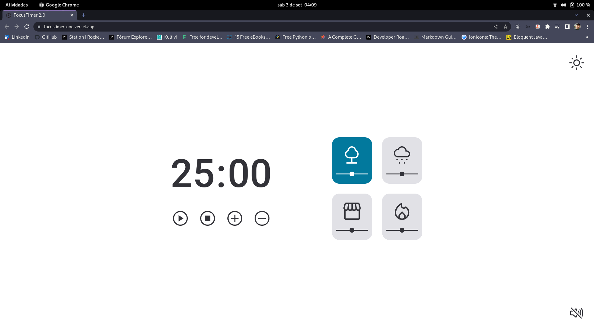
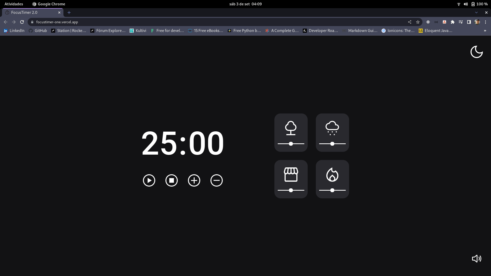

# FocusTimer 2.0
Projeto/desafio do Explorer da Rocketseat.

Timer estilo pomodoro para ajudar na concentração e no foco, com opções de sons ambiente e música de fundo, controles de tempo, play, pause e stop.

<figure>
    
    <figcaption>FocusTimer 2.0 light mode</figcaption>
</figure>

<figure>
  
  <figcaption>FocusTimer 2.0 dark mode</figcaption>
</figure>

[FocusTimer 2.0](https://focustimer-one.vercel.app/)