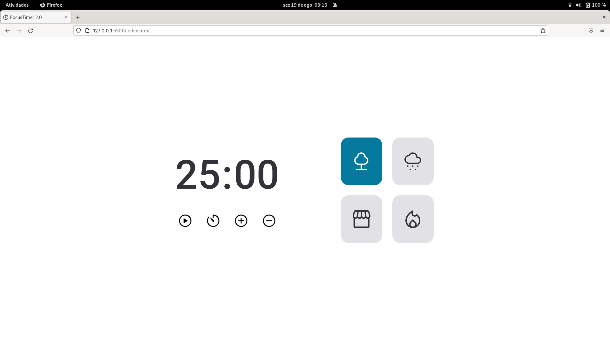

# FocusTimer 2.0

## Projeto em desenvolvimento.
 
Projeto/desafio do Explorer da Rocketseat.

Timer, estilo pomodoro, com alguns controles de tempo, play, pause e stop, além de algumas opções de sons para ajudar na concentração e foco.

